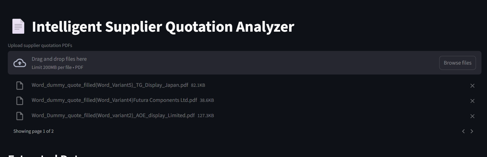
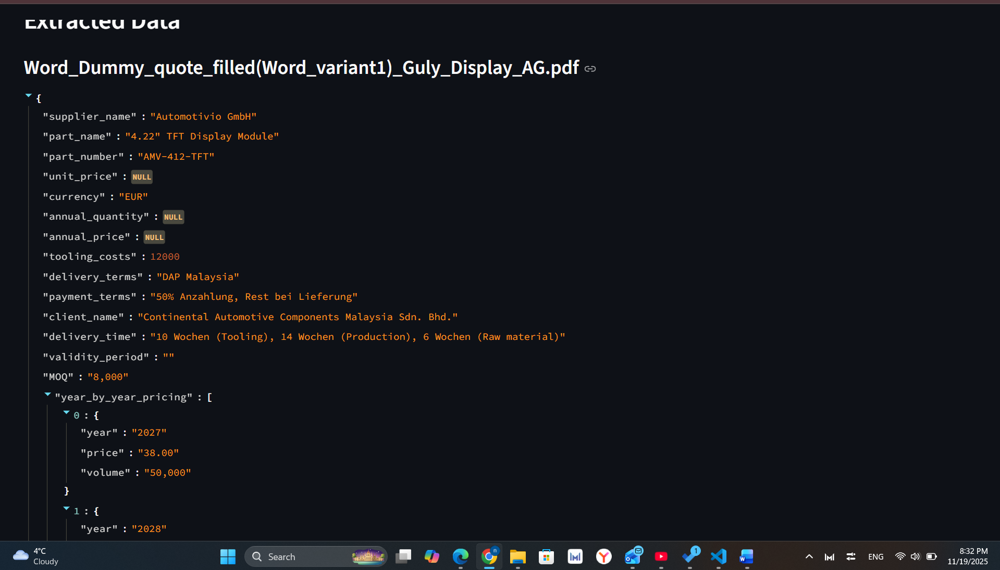
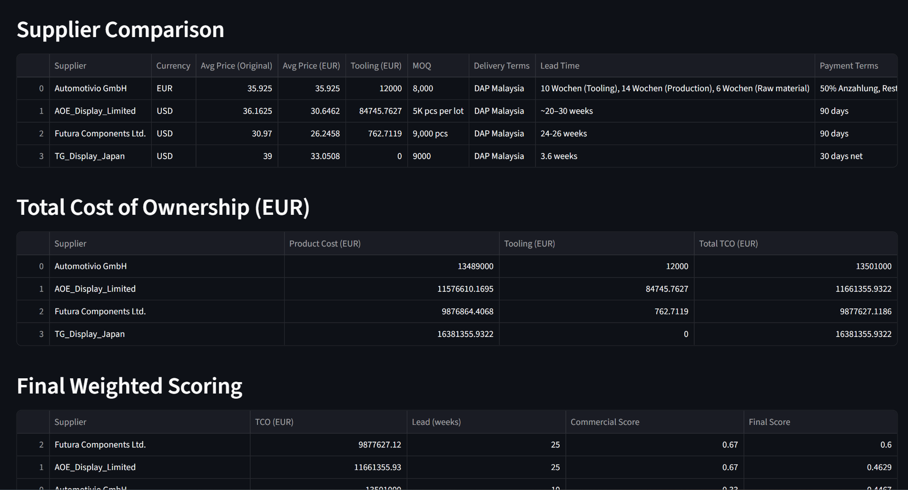
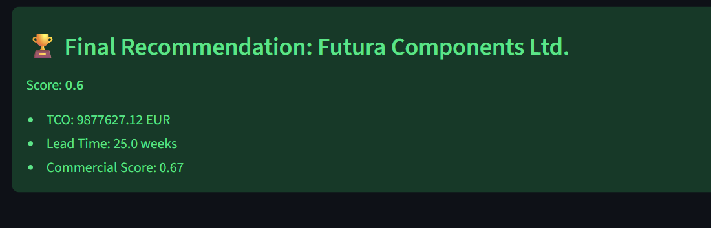

 Intelligent Supplier Quotation Analyzer

LLM Innovation Intern Task – Final Submission

An AI-powered tool that automatically extracts structured information from supplier quotation PDFs, compares multi-year pricing, evaluates total cost of ownership (TCO), and recommends the best supplier using a weighted scoring model.

Built with Python, Streamlit, PDF parsers, and an LLM-based extraction engine.

1) Features: 
✔ Automatic PDF Extraction

Extracts:
Supplier name
Client name
Year-by-year price table
Annual volumes
Tooling cost
Delivery terms
Payment terms
Technical specs
MOQ
Lead time
Notes & conditions
Handles missing fields gracefully.

✔ Currency Normalization
Converts all prices to EUR using latest exchange rates.

✔ Cost Comparison
Creates a comparison table with:
Avg unit price
Tooling cost
MOQ
Lead time
Delivery/payment terms

✔ Total Cost of Ownership (TCO)
Calculates in EUR
TCO = sum(price*volume) + tooling price

✔ Weighted Scoring Recommendation

Weights:
60% – TCO
30% – Lead time
10% – Commercial terms

✔ Streamlit GUI
Upload PDFs --> receive instant analysis.

2) Installation
1. Clone repository
git clone https://github.com/YOUR_USERNAME/llm-quotation-analyzer.git
cd llm-quotation-analyzer

2. Create virtual environment
python -m venv venv\
If you have Mac use:
source venv/bin/activate   

If you have Window use:
venv\Scripts\activate   

3. Install dependencies
pip install -r requirements.txt

3) Usage
Run Streamlit App:
streamlit run streamlit_app.py

GUI Flow:
Upload one or multiple supplier PDF quotations
View extracted structured data
Review comparison table
View TCO calculation
Receive final weighted recommendation

4) Project Structure
streamlit_app.py         # Main GUI
pdf_extractor.py         # PDF text extraction
llm_main.py              # LLM-based structured parsing
currency_ex.py           # Currency exchange + EUR conversion
scoring.py               # Scoring model (TCO, lead time, commercial)
requirements.txt         # Python dependencies
README.md                # Documentation

Sample PDFs are included under:

Place images in assets/screenshots/

5) Final Notes & Assumptions
Volumes such as 50.000 were cleaned to 50000

Lead-time text parsed into weeks

Futura Components PDF contains inconsistent capacity (noted)

No discounting/interest rate applied

TCO and scoring model simplified as per internship instructions

6) Author

Nurgul Amirkhan
LLM Innovation Intern Task Submission